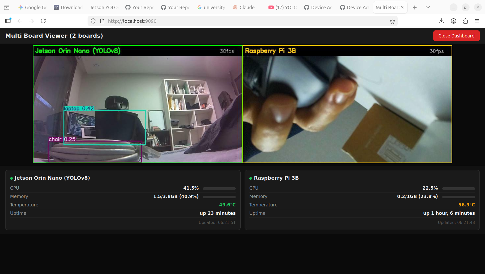

# Multi Board Viewer

여러 개발 보드의 카메라 스트림을 PC 한 화면에서 동시에 모니터링하는 통합 뷰어.

실시간 대시보드로 각 보드의 CPU, 메모리, 온도, 업타임을 확인할 수 있습니다.


*Jetson Orin Nano (YOLOv8 실시간 객체 탐지) + Raspberry Pi 3B 동시 스트리밍 + 대시보드*

## Features

- 멀티 보드 카메라 스트림 2x2 (또는 NxN) 그리드 뷰
- 실시간 대시보드 (CPU / Memory / Temperature / Uptime)
- 멀티스레드 서버 — 여러 기기에서 동시 접속 가능
- 보드 연결/해제 자동 감지 및 재연결
- 브라우저 모드 / OpenCV 윈도우 모드 지원

## Supported Boards

| 보드 | 스트리밍 | AI 추론 | 상태 |
|------|---------|--------|------|
| Jetson Orin Nano 4GB | MJPEG over HTTP | YOLOv8n TensorRT INT8 | 완료 |
| Raspberry Pi 3B | MJPEG over HTTP | - | 완료 |
| Jetson Nano | MJPEG over HTTP | YOLOv8n | 예정 |
| Zybo Z7-20 | GStreamer RTSP | FPGA CNN | 예정 |
| Arty Z7-10 | HDMI 캡처카드 | - | 예정 |

## Usage

```bash
# 브라우저 모드 (권장)
python3 multi_board_viewer.py --web
# http://localhost:9090 에서 확인

# OpenCV 윈도우 모드
python3 multi_board_viewer.py
```

## Requirements

```bash
pip3 install opencv-python-headless numpy
```

## Configuration

`multi_board_viewer.py`의 `BOARDS` 딕셔너리에서 보드를 추가/수정:

```python
BOARDS = {
    "Board Name": {
        "stream": "http://<board-ip>:8080/stream",
        "ssh": "user@<board-ip>",
    },
}
```

## Network

```
[공유기 LAN]
    ├── Jetson Orin Nano (192.168.219.108)
    ├── Raspberry Pi 3B  (192.168.219.109)
    ├── Jetson Nano       (예정)
    └── Zybo Z7-20        (예정)

[PC] → WiFi로 공유기에 연결 → multi_board_viewer.py 실행
```

## Related

- [Jetson-AI-Camera](https://github.com/squid55/Jetson-AI-Camera) — Jetson Orin Nano YOLOv8 실시간 추론
